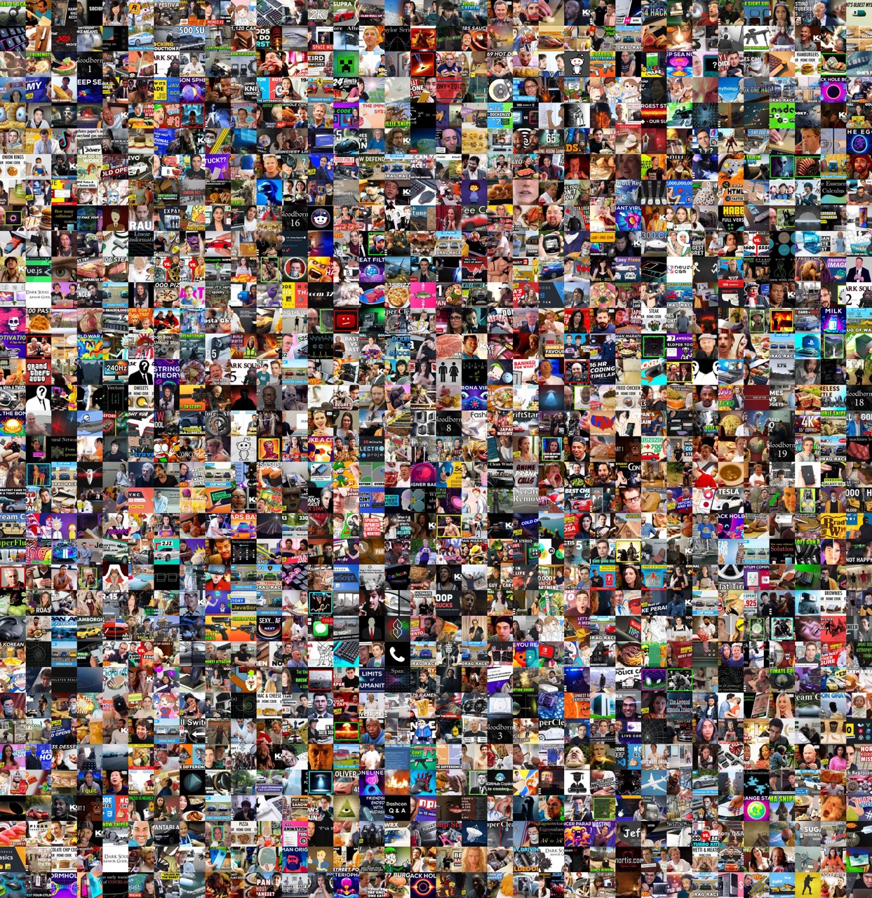

# Contact Sheet Generator

Contact Sheet Generator is a Python script that generates a contact sheet from a directory of images. It uses the `PIL` library to process images and `multiprocessing` to generate thumbnails in parallel. The contact sheet is created by arranging the thumbnails in a grid pattern.

## Requirements

- Python 3.x
- `PIL` library (`pillow` package)
- `multiprocessing` module
- `tqdm` library

## Usage

1. Clone the repository:

```shell
git clone https://github.com/cobanov/contact-sheet-generator.git
```

2. Install the required dependencies.

```shell
pip install pillow tqdm
```

3. Place your images in a directory.

4. Open the command prompt or terminal and navigate to the project directory.

5. Run the script with the following command:

```shell
python contact_sheet_generator.py /path/to/images output_contact_sheet.jpg
```

Replace /path/to/images with the directory path containing the images you want to generate a contact sheet from, and output_contact_sheet.jpg with the desired output file path for the contact sheet.

6. The script will start generating the contact sheet and display progress bars using the tqdm library.

7. Once the process completes, the contact sheet will be saved to the specified output file path.

## Output



## Additional Notes

The thumbnail_size variable in the script can be adjusted to control the size of the thumbnails in the contact sheet.

The script uses the center square crop technique to crop the images before generating thumbnails. This ensures that each thumbnail is a centered square.

The script utilizes multiprocessing to generate thumbnails in parallel, which can significantly speed up the process for a large number of images.

Progress tracking is added using the tqdm library, which displays progress bars while generating thumbnails and processing the images.

The temporary thumbnail directory used during the process will be cleaned up automatically after the contact sheet is generated.

Feel free to modify and customize the script according to your specific requirements!

## License

This project is licensed under the [MIT License](https://choosealicense.com/licenses/mit/)
